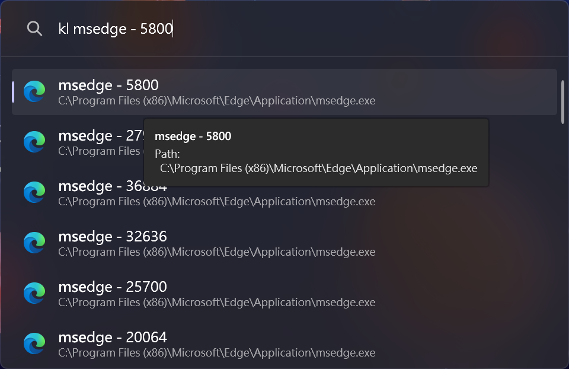
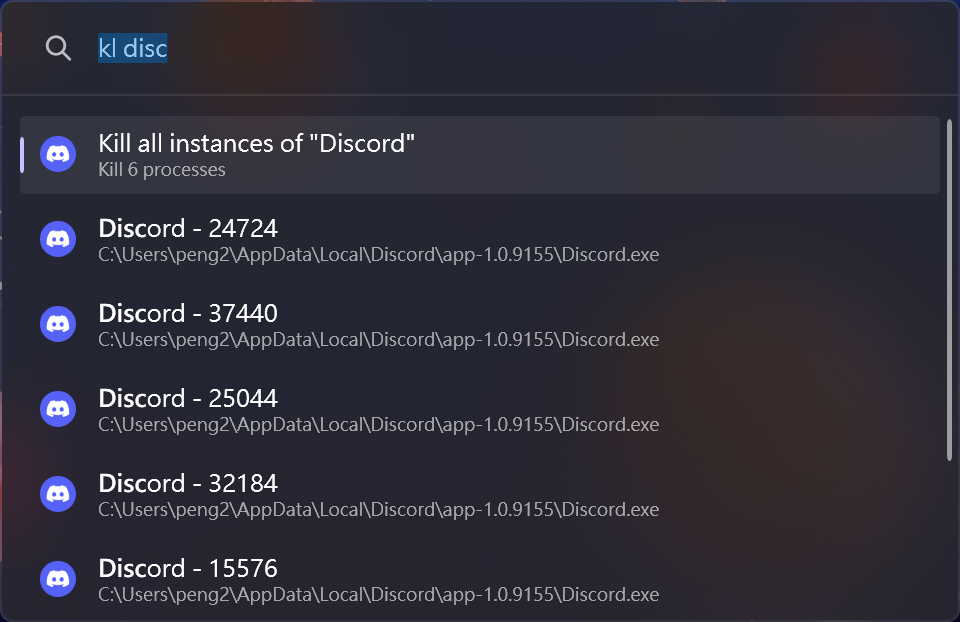
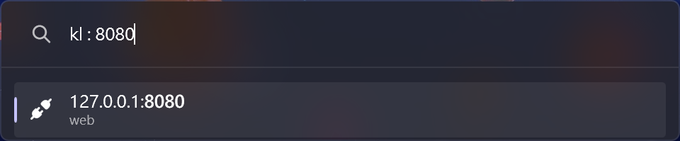

# ProcessKiller Plugin for PowerToys Run

A [PowerToys Run](https://aka.ms/PowerToysOverview_PowerToysRun) plugin to kill processes.

Derived from FlowLauncher Plugin [ProcessKiller](https://github.com/Flow-Launcher/Flow.Launcher/tree/dev/Plugins/Flow.Launcher.Plugin.ProcessKiller).

Checkout the [Template](https://github.com/8LWXpg/PowerToysRun-PluginTemplate) for a starting point to create your own plugin.

## Features

### Kill a process

### Kill all instances of a process

### Kill a process by Port number

use `kl : <ip:port>` to search for IP and Port.

## Installation

1. Download the latest release of the from the releases page.
2. Extract the zip file's contents to `%LocalAppData%\Microsoft\PowerToys\PowerToys Run\Plugins`
3. Restart PowerToys.

## Usage

1. Open PowerToys Run (default shortcut is <kbd>Alt+Space</kbd>).
2. Type `kl` and search for process name or ID.

## Building

1. Clone the repository and the dependencies in `/lib` with `ProcessKiller/copyLib.ps1`.
2. run `dotnet build -c Release`.

## Debugging

1. Clone the repository and the dependencies in `/lib` with `ProcessKiller/copyLib.ps1`.
2. Build the project in `Debug` configuration.
3. Make sure you have [gsudo](https://github.com/gerardog/gsudo) installed in the path.
4. Run `debug.ps1` (change `$ptPath` if you have PowerToys installed in a different location).
5. Attach to the `PowerToys.PowerLauncher` process in Visual Studio.

## Contributing

### Localization

If you want to help localize this plugin, please check the [localization guide](./Localizing.md)
